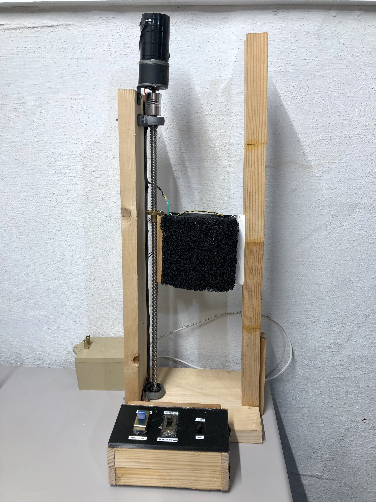

# Actuated Fume Extractor

Air filtration is extremely important when it comes to soldering - the noxious fumes can stand as a serious health hazard if not delt with properly. The typical solution involves purchasing a soldering fume extractor to remove and purify dangerous soldering emissions. 

I've never been satisfied with this solution. The devices one finds when searching are little more than a miniature fan with a cheap carbon filter joined to the front grill. On top of that, they offer no customizability or variability to adjust to workflow. 

I decided to design & fabricate my own fume extractor addresses these problems using spare parts from old projects and machines. The result is a device that boasts more features than even the most popular and pricey fume extractors on the market, all while doing so at less than half the cost of the cheap ones. 

More information is available on my website [here](https://www.markhofmeister.com/actuated-fume-extractor)
